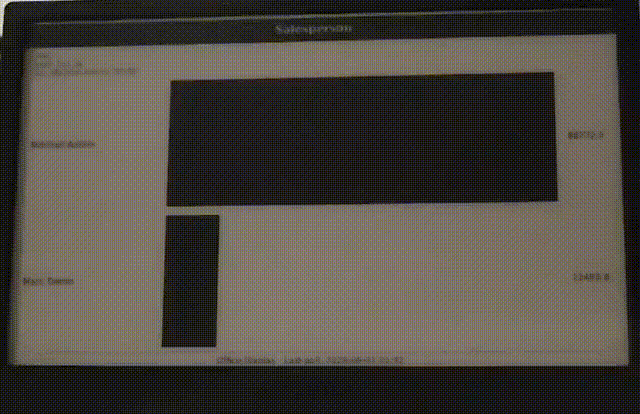

# Odoo IoT für Digital Signage


## Project description

The **TRMNL** Odoo module is an IoT extension for the open source ERP system Odoo that enables the management of TRMNL e-ink displays. The goal of the project is to show live Odoo data (for example calendar events, tasks, sales orders, or product information) on energy-efficient displays without relying on the TRMNL cloud.

The module acts as a self-hosted API server for TRMNL hardware. Devices pair directly with your Odoo instance, poll for display content over HTTP, and receive dynamically rendered PNG images (list layouts are 1-bit; kanban, calendar, and graph layouts use grayscale). Administrators manage devices, configure display profiles, and control access policy from the standard Odoo backend.

This module was developed as part of the Software Engineering Lab at the University of Bern, in cooperation with Abilium GmbH. It is **not** affiliated with TRMNL Holdings LLC.

<p align="center">
  
</p>

## Features

- **Device management:** Register, monitor, and control TRMNL displays from **TRMNL → Devices** in Odoo
- **Display profiles:** Render Odoo records as list, kanban, calendar, or graph layouts on e-ink screens
- **Self-hosted integration:** Implements the TRMNL device protocol (`/api/setup`, `/api/display`, `/api/log`, `/api/profile/image/<id>`) inside Odoo
- **E-Ink display support:** Serves optimized PNG images in an energy-saving way
- **HTTP polling:** Transfers display updates reliably between Odoo and TRMNL devices over Wi-Fi
- **Display policy:** Control how unknown or mismatched devices are handled (error, auto-accept, or factory reset)
- **Status updates:** Automatically refreshes displays when source data changes or on a configurable render interval

## Technical requirements

### Server requirements

- Odoo v19.0
- Python 3.x with Pillow (required by the module; see `requirements.txt` for Docker image packages)
- PostgreSQL
- Network connection so TRMNL devices can reach your Odoo server (LAN IP, public URL, or Odoo.sh)

### Display hardware

- TRMNL e-ink display with custom-server firmware (team-tested with v1.8.2; the module does not enforce a minimum version)
- Wi-Fi connection
- Stable power supply

### Development (optional)

- Docker and Docker Compose (or Podman Compose)
- `make`

## Getting started

### Quick start with Docker

1. Clone the repository:
  ```bash
  git clone https://github.com/Abilium-GmbH/pse_trmnl_odoo_connector.git
  cd pse_trmnl_odoo_connector
  ```
2. Start Odoo and install the module:
  ```bash
  make
  ```
  On a fresh database, this starts PostgreSQL and Odoo, then installs `base` and `trmnl` automatically.
3. Open Odoo in your browser:
  ```
  http://localhost:8069
  ```
  Default login: email `admin`, password `admin`.
4. If the module is not installed yet, go to **Apps**, remove the **Apps** filter, search for **TRMNL**, and install it.

### Configure `web.base.url` (required for Docker / LAN)

Before pairing a TRMNL device on a local or Docker setup, set a URL that the **device can reach** (not `localhost`):

1. In Odoo go to **Settings → Technical → System Parameters**.
2. Set `web.base.url` to your host LAN address, for example `http://192.168.1.50:8069`.
3. Optionally set `trmnl.public_base_url` to the same value.

TRMNL devices download profile images over HTTP. If `web.base.url` points to `localhost` or `127.0.0.1`, image URLs on the profile form may show a warning and the device may not load new PNGs reliably. On **Odoo.sh**, use your instance HTTPS URL.

See section **6.6 Image URLs and `web.base.url`** in the [user guide](docs/user_guide.pdf) for details.

### Manual Docker setup

If you prefer raw Docker Compose commands, run them from the repository root (where `compose.yaml` lives):

```bash
docker compose up -d db
docker compose run --rm odoo odoo -d odoo -i base --stop-after-init
docker compose up -d odoo
```

After the first setup, start the stack with:

```bash
docker compose up -d
```

Stop it with:

```bash
docker compose down
```

### Connect a TRMNL display

Pair your device with Odoo using the **Custom Server** flow on the TRMNL configuration page. For local or Docker setups, point the device at your machine's LAN address (for example `http://192.168.1.50:8069`), not `localhost`.

Step-by-step pairing, profile setup, and troubleshooting are in the [user guide (PDF)](docs/user_guide.pdf).

### Setup demo video

Direct link: [docs/assets/videos/odoo_setup.mp4](docs/assets/videos/odoo_setup.mp4)

### Environment variables

`compose.yaml` reads from a `.env` file. If none exists, defaults from `compose.yaml` are used. Copy `.env.example` to `.env` and adjust values as needed:

```bash
cp .env.example .env
```

On some Linux distributions (for example Fedora), Podman is recommended instead of Docker. See the [development guide](docs/development.md) for `local.mk` overrides.

## Documentation


| Document                                             | Description                                       |
| ---------------------------------------------------- | ------------------------------------------------- |
| [User guide (PDF)](docs/user_guide.pdf)              | Pairing, devices, profiles, troubleshooting       |
| [Design documentation](docs/design_documentation.md) | Architecture, HTTP API, security, data model      |
| [Development guide](docs/development.md)             | Local workflow, Make targets, running tests       |
| [Repository structure](docs/repository_structure.md) | Folder layout and module organization             |


## Development and customization

| Document                                             | Description                                       |
| ---------------------------------------------------- | ------------------------------------------------- |
| [User guide (PDF)](docs/user_guide.pdf)              | Pairing, devices, profiles, troubleshooting       |
| [Design documentation](docs/design_documentation.md) | Architecture, HTTP API, security, data model      |
| [Development guide](docs/development.md)             | Local workflow, Make targets, running tests       |
| [Curl commands](docs/curl_commands.md)               | Example `curl` calls to simulate device API polls |
| [Repository structure](docs/repository_structure.md) | Folder layout and module organization             |


## Development and customization

The module can be extended to implement additional functions:

- New profile view types or renderers for other Odoo models
- Custom display policies or onboarding workflows
- Integration with additional TRMNL firmware features
- Support for other e-ink display form factors

Contributors should start with `make watch` for live module reloads and `make test` for the isolated test suite. See the [development guide](docs/development.md) for details.

## Development Team

- Timur Umut Turgul - Key Account Manager (client contact)
- Sascha Friedli - Chief Deliverable Officer (deliverables and scheduling)
- Leila Ayinkamiye - Quality Evangelist (test concept and testing)
- Claudio Berger - Master Tracker (status reports and tracking)
